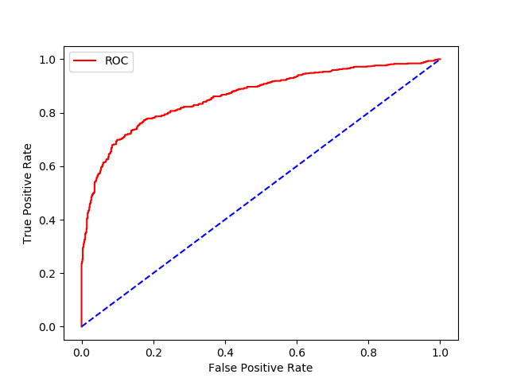

# NLP with Disaster Tweets
This is a project based on a 
[kaggle competition](https://www.kaggle.com/c/nlp-getting-started/overview) 
that requires participants to predict which tweets are about real disasters and which are not. The dataset
was originally created by figure-eight and is available for download on their
[website](https://www.figure-eight.com/data-for-everyone/).

After numerous rounds of experimenting with different classifiers as well as their hyperparameters, I have 
narrowed down to Multinomial Naive Bayes and Complement Naive Bayes. Below are the results that I used to
compare before deciding to go with Multinomial NB, with an alpha of 0.75. It achieves an f1 
score of 0.80061.

Update (10/03/2020): After trying transfer learning using pretrained BERT, my f1 score got boosted to 0.82413. Find 
the notebook [here](https://github.com/toomuchmath/kaggle_disaster_tweets/blob/master/scripts/BERT_pytorch_disaster_tweets.ipynb).

``` 
MultinomialNB(alpha=0.75)

AUC: 0.862

confusion matrix
[[792  90]
 [193 448]]

classification report
              precision    recall  f1-score   support

         0.0       0.80      0.90      0.85       882
         1.0       0.83      0.70      0.76       641

    accuracy                           0.81      1523
   macro avg       0.82      0.80      0.80      1523
weighted avg       0.82      0.81      0.81      1523
```

```
ComplementNB(alpha=2.5) 

AUC: 0.860

confusion matrix
[[745 137]
 [163 478]]

classification report
              precision    recall  f1-score   support

         0.0       0.82      0.84      0.83       882
         1.0       0.78      0.75      0.76       641

    accuracy                           0.80      1523
   macro avg       0.80      0.80      0.80      1523
weighted avg       0.80      0.80      0.80      1523
```

Multinomial NB has the following ROC curve:

 
 